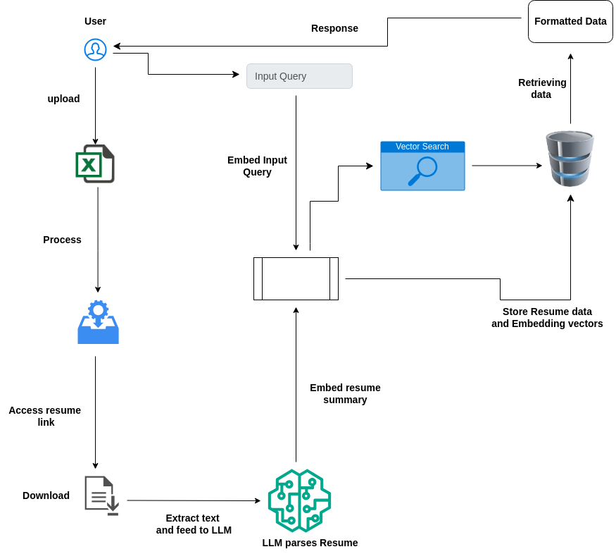

# Resume Evaluator System

This project is a Resume Evaluator System that processes resumes, extracts key information, generates vector embeddings, and allows querying to retrieve relevant candidate profiles based on user input.

## Features
- **Upload Resumes:** Upload a Excel file containing links to candidate resumes.
- **Resume Processing:** Extract and parse text from resumes, generate summaries, and store vector embeddings in PostgreSQL using PGVector.
- **Query:** Input natural language queries to retrieve relevant candidate profiles.

## Architecture Diagram



## Installation

### Prerequisites
- **Python 3.10**
- **PostgreSQL with PGVector extension**
- **Django 5.1**

### Setup

1. **Clone the Repository:**
   ```bash
   git clone https://github.com/yourusername/resume-evaluator.git
   cd resume-evaluator
   ```

2. **Create a Virtual Environment:**
   ```bash
   python -m venv venv
   source venv/bin/activate  # On Windows use `venv\Scripts\activate`
   ```

3. **Install Requirements:**
   ```bash
   pip install -r requirements.txt
   ```

4. **Create `.env` File:**
   In the root directory of the project, create a `.env` file and add the following credentials:
   ```env
   OPENAI_API_KEY = "<your_openai_api_key>"
   AZURE_OPENAI_ENDPOINT = "<your_azure_openai_endpoint>"
   OPENAI_API_TYPE = "azure"
   OPENAI_API_VERSION = "2023-08-01-preview"
   MODEL_NAME = "<your_model_name>"
   DEPLOYMENT_NAME = "<your_deployment_name>"
   USER_ID = "<your_user_id>"
   VECTORIZATION_MODEL_NAME = "<your_vectorization_model_name>"
   VECTORIZATION_DEPLOYMENT_NAME = "<your_vectorization_deployment_name>"
   VECTORIZATION_USER_ID = "<your_vectorization_user_id>"
   DB_HOST = "<your_db_host>"
   DB_PORT = "<your_db_port>"
   DB_USER = "<your_db_user>"
   DB_PASSWORD = "<your_db_password>"
   DB_DATABASE = "<your_db_name>"
   ```

5. **Setup PostgreSQL with PGVector:**

   Follow these steps to set up PostgreSQL with the `pgvector` extension using Docker:

   - **Pull the Docker Image:**
     ```bash
     docker pull ankane/pgvector
     ```

   - **Run the Docker Container:**
     ```bash
     docker run --name pgvector-demo -e POSTGRES_PASSWORD=mysecretpassword -p 5432:5432 -d ankane/pgvector
     ```

   - **Verify the Container is Running:**
     ```bash
     docker ps
     ```

   - **Connect to PostgreSQL Database:**
     Use a GUI tool like pgAdmin or the command-line tool `psql` with the following details:
     - **Host:** `localhost`
     - **Port:** `5432`
     - **Username:** `postgres`
     - **Password:** `mysecretpassword`

   - **Create Database and Install Extension:**
     ```sql
     CREATE DATABASE vector_db;
     \c vector_db
     CREATE EXTENSION pgvector;
     ```

6. **Migrate Database:**
   ```bash
   python3 manage.py migrate
   ```

7. **Run the Server:**
   ```bash
   python3 manage.py runserver
   ```

8. **Access the Application:**
   Open your browser and navigate to `http://127.0.0.1:8000`.

## API Endpoints

- **Upload Excel File:**
  - **Endpoint:** `/evaluator/file_upload/`
  - **Method:** `POST`
  - **Description:** Upload a Excel file containing resume links and process those resumes.

- **Query Candidate Profiles:**
  - **Endpoint:** `/evaluator/user_query`
  - **Method:** `GET`
  - **Description:** Query the system using a natural language question to retrieve relevant resumes.

## Contributing

Feel free to fork this project, submit pull requests, or open issues for any bugs or feature requests.
